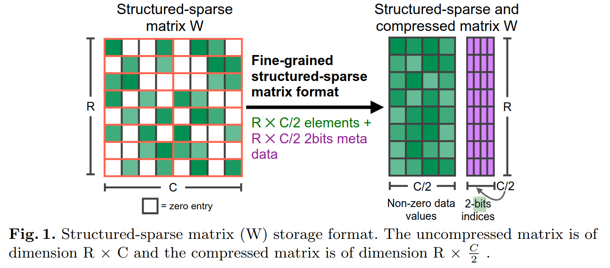

# Centralised Repo of Advanced PyTorch Efficiency
- Recapping the PyTorch I know already with theoretical underpinnings
- Also extending to other niche PyTorch stuff towards signal processing etc...

## Dense vs Sparse
#### Dense
- All vals stored in mem
- Efficient for small matrices
- `A @ A    # O(n^3) for n x n matrix` 

#### Sparse
- `A @ B    # O(nnz(A) * nnz(B)) ; nnz = number of non-zeros in`
- Non-zeros and indices stored
- Overheads on smaller matrices
- **Stride:**
    * It tells you for each dimension of a tensor how many elements of stride it takes to move 1 along this dimension
    * e.g. `torch.rand(3,64,64) # (4096, 64, 1)`
    * it takes 4096 jumps to move 1 up the first dimension, 64 jumps for the second etc...
- **If some of your dimensions are dense:**
    * I can take advantage using `to_sparse(dense_dim=n)`
    * Dense dimensions should always be the last ones, this is why I need only speicfy the number of dense dimensions (this is for efficiency sake)
    * It is my responsibility to ensure that dense dimensions are at the end of the tensor

#### Case: 2D Sparse Unstructured
- **COO: Co-ordinate List**
    * Better for smaller and matmuls
    * 3 arrays stored
        + `row_indices`
        + `col_indices`
        + `values`
    * When to use:
        + Ireggular, randomly distributed non-zeros (well distributed)
        + Constructing something with good random reads
    * Performance:
        + Flexible for storing any pattern
        + Not always most efficient, but reasonable

#### Case: 2D Sparse Speedup on ampere GPUs
- **2:4 Structured Sparsity**
    * Where at most 2 elements are non-zero for every 4
    * Of every 4 consecutive elements, 2 must be non zero
    * This is chosen by a pruning algorithm that prioritises the most significant entries
    * I think it is assumed to mostly be applied to neural nets
    * Generally improves both speed and memory, but mostly speed
    * Useful for Ampere GPUs and upwards `30 series`
    * This is **NOT** enable by default
    * Would need to manually sort these in code and cast myself
```python
# TODO Check if this actually works
import torch
from torch import nn
from torch.nn.utils import prune

layer = model.encoder.layer[0].attention.self.query
prune.l1_unstructured(layer, name='weight', amount=0.5) # L1 Pruning applied

sparse_tensor = layer.weight.to_sparse()
```

- The compressed non-zero matrix
- The accompanying mask matrix is 2 bits PER non-zero value

#### 
- **CSR: Compressed Sparse Row**
    * Better for bigger and matmuls
    * Use for row-wise traversal heavy stuff
    * 3 things stored
        + `col_indices`
        + `values`
        + `row_ptr` <- Foe each row, find the index of the first non-zero, then put the absolute position in the `values` list of that first non-zero in here
    * When to use:
        + Amazing for row based operations (row-wise sum, matrix-vector product)
        + Used when sparsity is row-wise (most rows sparse with some dense regions)
        + Good with dense sub-matrices
    * Performance:
        + Fast access to rows and efficient for matrix ops


- **CSC: Compressed Sparse Column**
    * Good for bigger matmuls
    * Column-wise traversal
    * 3 arrays stored
        + `row_indices`
        + `values`
        + `col_ptr`
- **BSR: Block Sparse Row**


| **Format** | **Best for** | **When to Use** | **Best for Operations** | **Memory Efficiency** | **Performance** |
| -------- | -------- | -------- | -------- | -------- | -------- |
| COO | Randomly distributed non-zero elements | Highly irregular sparsity (3D/4D tensors) | Construction, random access | Flexible but less efficient for large matrices | Good for small to medium matrices, slow for large |
| CSR | Row-centric sparsity | Row-based operations, row-wise sparsity (2D matrix) | Fast matrix-vector multiplication, row-wise operations | Efficient for row-based access | Faster for large sparse matrices with row sparsity |
| CSC | Column-centric sparsity | Column-based operations, column-wise sparsity | Fast matrix-vector multiplication, column-wise operations | Efficient for column-based access | Faster for large sparse matrices with column sparsity |
| BSR | Blocked sparse matrices (banded or block structure) | Band matrices or block-sparse matrices | Block operations (e.g., block matrix multiplication) | More efficient for block-sparse matrices | Fast for block matrix operations, less memory usage |


- `coalesce()` what exactly is this doing UTH

## Matrix - Vector Mult
- **Dense:** `O(n^2)    # for size n x n`
- **Sparse:** `O(k)     # k = nnz`

## Matrix Multiplication
#### Elementwise:
- `torch.mul(A,B)` 
    * **Dense:** `O(nm)` of course
    * **Sparse:** `O(k) # k = nnz`
    * `torch.einsum('ij,ij->ij', A, B) # DNU Overhead`

#### Full
- `torch.matmul(AB,BC)` & `AB @ BC`
    * **Dense:** `O(n^3) = O(a*b*c)` for `AB.shape = (a,b), BC.shape(b,c)`
    * **Sparse:** `O(nnz(AB) * nnz(BC))`
    * `torch.einsum('ij,jk->ik', AB, BC) # DNU Overhead`


## Triangles & Diagonals
#### Identity Matrix
- `torch.eye(n)`
    * You NEVER need to store this. Can always just create it
#### Vanilla Diag & Singular Super/Sub Diags
- `torch.diag(A)`
    * `O(min(m,n))`
    * Don't forget `torch.diag(A,1)` gives 1 above diag. or -1 etc...
    * `torch.einsum('ii->i') # ii refers to diagonals, think as a summation notation`
        + `'i,i+1->i'` for superdiag
        + `'i,i-1->i'` for subdiag

#### Upper & Lower Triangles
- `torch.triu(A)` & `torch.tril(A)`
    * `O(n^2)` cos it has to traverse the entire matrix once under the hood
    * `torch.triu(A, 1)` starts from the direct superdiagonal (diag is lost)
    * `torch.triu(A, -1)` starts from direct subdiagonal (extra diag added
